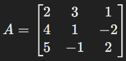

# The Matrix Decoder
## Background:
In linear algebra, matrices and their operations are fundamental in solving systems of linear equations, transformations, and more.
Determinants are particularly useful in finding the inverse of a matrix or checking if a matrix is invertible.

## Question:
Consider the following 3x3 matrix A:



The determinant is hidden with a flag in the web page provided.

Inspect its source code to find what you seek.

## Flag Format:
```
FLAG-RAID{enter_flag}
```

Replace `enter_flag` with your flag.