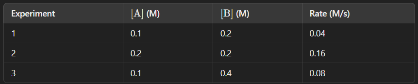

# The Reaction Rate Riddle
## Background:
In chemistry, the rate of a reaction can be influenced by various factors, including concentration, temperature, and the presence of catalysts.
Understanding the rate laws can help predict how the concentration of reactants affects the speed of a reaction.

## Question:
Consider the following hypothetical reaction:

    A+2B→C

The rate law for the reaction is given as:

<blockquote><em>Rate=k[A]m[B]n</em></blockquote>

Where:

- 𝑘 is the rate constant.
- 𝑚 and 𝑛 are the orders of the reaction with respect to reactants A and B.

You are given the following experimental data:

Find the 𝑘 value.

## Flag Format:
`FLAG-RAID{k_value}` 
replace `k_value` with the answer you got.