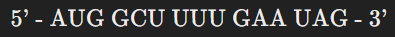

# The Genetic Code Engigma
## Background:
The genetic code is the set of rules by which information encoded in genetic material (DNA or RNA sequences) is translated into proteins by living cells.
Each group of three nucleotides, known as a codon, specifies a particular amino acid.

## Question:
The mRNA sequence given below is part of a gene that codes for a protein:

Translate the mRNA sequence into its corresponding amino acid sequence using the genetic code.
Use the standard abbreviations for amino acids.

## Flag:
The flag is the first amino acid coded by this mRNA sequence, formatted as `FLAG-RAID{X}` where X is the three-letter abbreviation of the amino acid (in lower case).
