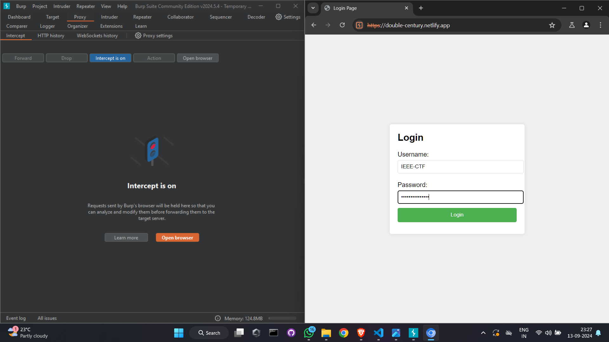
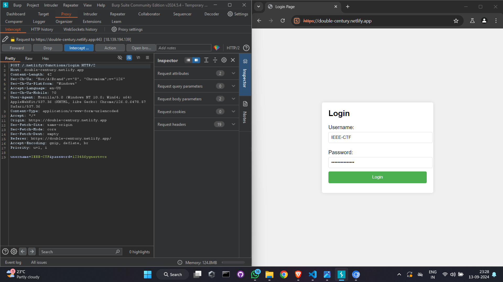
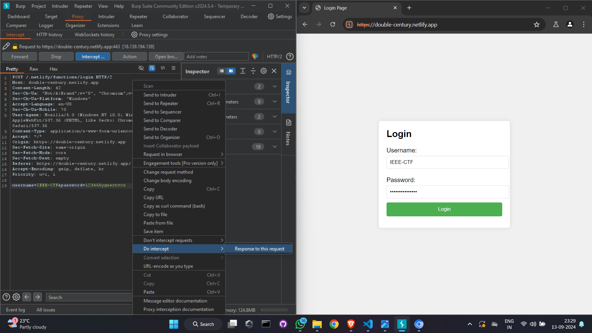
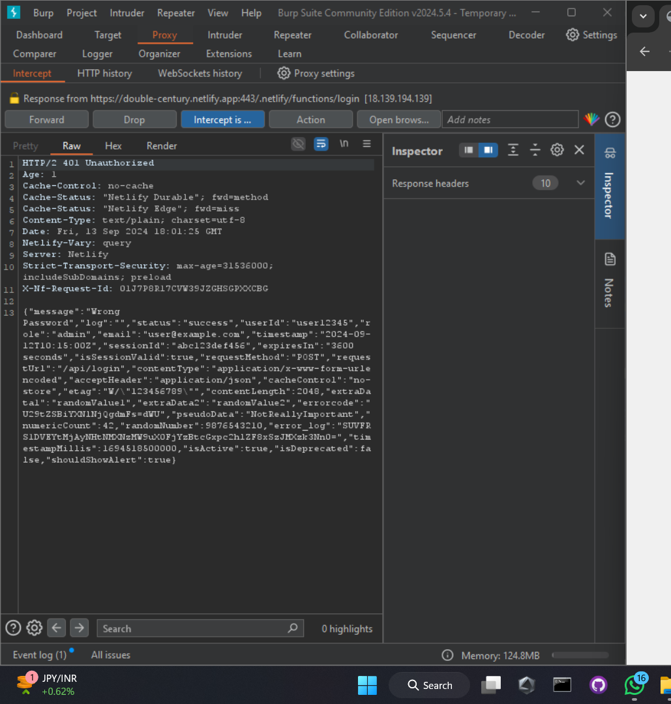
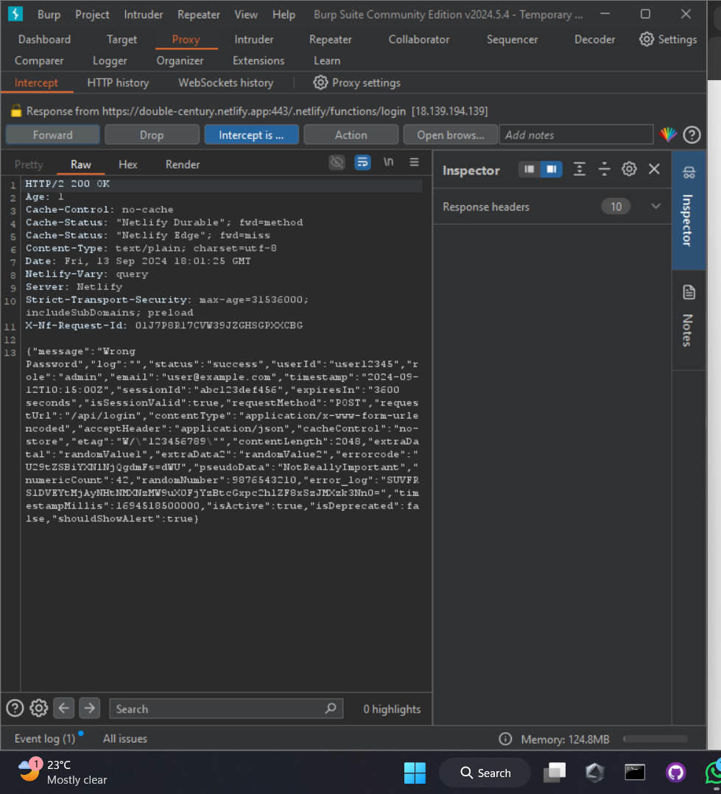

# Challenge Name: Double Century

#### Author: Mohammed Musharraf 
#### Difficulty: [Hard]

#### Points: 100

#### Wave: 3
#### Number of Solves: 11

## Hints and Clues
- **Title Insight:** "Double Century" alludes to the significance of the number 200.
- **Response Code:** The HTTP response code 200 plays a crucial role in solving the challenge.
- **OK Message:** The presence of "OK" in the question suggests that the solution involves examining success responses closely.

## Prerequisites
- **Burp Suite:** [Download Here](https://portswigger.net/burp/releases#community)

## Solution

### Step 1: Set Up Burp Suite
1. Open Burp Suite and navigate to the **Proxy** tab.
2. Click on **Intercept** and then **Open Browser**. This will launch a Chromium browser instance.
   

### Step 2: Navigate to the Challenge URL
1. In the Chromium browser, go to the provided challenge URL.
2. Enter a random password in the password field.
3. Turn on **Intercept** in Burp Suite.
   

### Step 3: Intercept and Inspect the Request
1. Click on **Login**. Burp Suite will capture the POST request.
   
2. Right-click on the request and select **Do Intercept** > **Response to this Request**.
   

### Step 4: Modify the Response
1. Click on **Forward** to view the response from the server.
   
2. Locate the line containing `401 Unauthorized` and replace it with `200 OK`.
3. Click **Forward** again to send the modified response.
   

### Final Step: Reveal the Flag
After forwarding the modified response, you will see the flag displayed.

**Flag:**
`FLAG-RAID{M1ss1on_Acc0mplished_1K2L_976}`

## Alternate Way to Solve:

1. Enter a random password and inspect the page.
2. Go to network tab.
3. Click on response code `400` in this case.
4. View the response and find the value for key flag.
5. The value of key flag contains the actual flag which is base64 encoded.